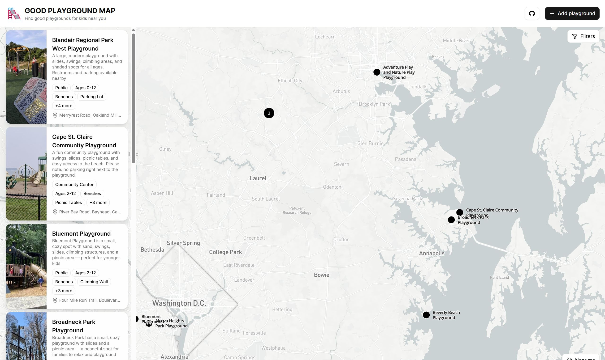

# 🛝 Good Playground Map



A modern web app to discover and share the best playgrounds for kids near you.

> **Note:** Data is still uploading, and not all areas are filled yet. You can check the DMW area as an example: [Good Playground Map - DMW Area](https://www.goodplaygroundmap.com/?south=38.8539&north=39.3606&west=-77.1673&east=-76.199)

## Features

- Interactive map to find playgrounds near you (Mapbox)
- Playground list and details with photo upload, access types, and features
- Add new playgrounds with a simple dialog
- Mobile-friendly and responsive design
- Playground data stored in Supabase (DB & Storage)
- Deployed on Vercel

## Tech Stack

- [Next.js](https://nextjs.org/) (React framework)
- [Mapbox](https://www.mapbox.com/) (interactive maps)
- [Supabase](https://supabase.com/) (database & storage)
- [Vercel](https://vercel.com/) (deployment)
- [pnpm](https://pnpm.io/) (package manager)
- [shadcn/ui](https://ui.shadcn.com/) (UI components)

## Getting Started

1. Clone the repo
2. Install dependencies with `pnpm install`
3. Set up environment variables for Supabase and Mapbox (contact me for access)
   - Create a `.env.local` file in the root directory and add the following variables:
     ```bash
     NEXT_PUBLIC_MAPBOX_ACCESS_TOKEN=your_mapbox_token
     NEXT_PUBLIC_SUPABASE_URL=your_supabase_url
     NEXT_PUBLIC_SUPABASE_ANON_KEY=your_supabase_anon_key
     ```
4. Run the app locally with `pnpm dev`

## Contributing

Feel free to reach out if you want to contribute or have ideas:  
**ivan.seredkin@gmail.com**
