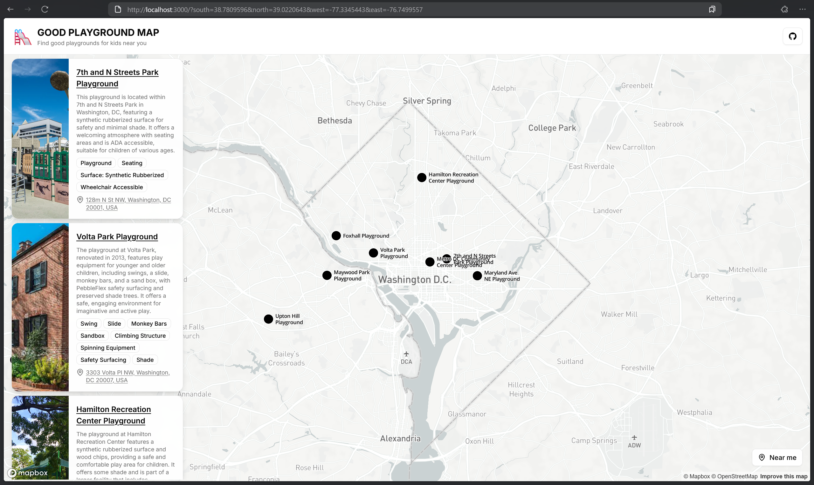

# 🛝 Good Playground Map



**Discover the perfect playground near you with an AI-powered map that transforms basic pins into rich, detailed profiles.**

Good Playground Map isn't just another map app. It's a comprehensive discovery tool that leverages a revolutionary data pipeline:

✨ **OpenStreetMap's global playground data** → **Google Maps address enrichment** → **Perplexity AI-powered playground research** → **Detailed, actionable playground profiles**

This intelligent combination of open data and AI automatically researches and presents detailed information about each playground, making your search for the perfect play spot easier and more informed.

## 🤔 Why Good Playground Map?

Finding a great playground can be time-consuming. Standard maps might show a pin, but they often lack crucial details: What equipment is there? Is it suitable for toddlers? Is parking available?

Good Playground Map solves this by:
*   **Automating Research:** No more manual searching across multiple websites.
*   **Providing Rich Details:** Get AI-generated summaries, features, and potentially even user-uploaded photos.
*   **Centralizing Information:** Everything you need to know in one place.

## 💡 The Magic Behind It: Intelligent Data Enrichment

What makes this app unique is its **intelligent data enrichment pipeline**:

1.  **Discovery**: Pulls playground locations from OpenStreetMap's vast global database.
2.  **Enrichment**: Uses the Google Maps Geocoding API to convert coordinates into precise, detailed addresses.
3.  **AI-Powered Context**: Leverages Perplexity AI to automatically research and generate rich, descriptive information about each playground based on its location and name.

This process transforms simple map markers into comprehensive resources, offering a superior user experience.

## ✨ Features

*   **Intelligent Data Pipeline**:
  *   OpenStreetMap integration for global playground discovery.
  *   Google Maps geocoding for precise address information.
  *   Perplexity AI for automated playground research and descriptions.
*   **Interactive Exploration**:
  *   Responsive Mapbox-powered map interface.
  *   Searchable playground listings with filtering capabilities.
  *   Detailed playground profiles with AI-generated info, (and eventually) photos and features.
*   **[In The Future] Community Tools**:
  *   Easily add missing playgrounds via a simple dialog.
  *   Upload photos of playgrounds you visit.
  *   Personal profile with "My Playgrounds" for saving favorites.

## 🛠️ Tech Stack

*   **Framework**: [Next.js](https://nextjs.org/)
*   **UI**: [shadcn/ui](https://ui.shadcn.com/)
*   **Maps**: [Mapbox](https://www.mapbox.com/)
*   **Data Sources**:
  *   [OpenStreetMap](https://www.openstreetmap.org/) (Playground locations)
  *   [Google Maps Geocoding API](https://developers.google.com/maps/documentation/geocoding) (Address lookup)
  *   [Perplexity AI](https://www.perplexity.ai/) (Information enhancement)
*   **Backend & Auth**: [Supabase](https://supabase.com/) (Database, Storage, Authentication)
*   **Deployment**: [Vercel](https://vercel.com/)
*   **Package Manager**: [pnpm](https://pnpm.io/)

## 🚀 Getting Started

Follow these steps to set up the project locally:

1. Clone the repository.
2. Install dependencies:
   ```bash 
    pnpm install
   ```
    
3. Set up environment variables:
    - Create a `.env.local` file in the root directory and add the following variables:
      ```bash
      # Secrets
      NEXT_PUBLIC_SUPABASE_URL=your_supabase_url
      NEXT_PUBLIC_MAPBOX_ACCESS_TOKEN=your_mapbox_token
      GOOGLE_MAPS_API_KEY=your_google_maps_api_key
      PERPLEXITY_API_KEY=your_perplexity_api_key

      # Perplexity Config
      PERPLEXITY_MODEL=sonar-pro
      PERPLEXITY_TEMPERATURE=0.17
      PERPLEXITY_SEARCH_CONTEXT_SIZE=medium

      # OSM Config
      OSM_QUERY_TIMEOUT=5
      OSM_QUERY_LIMIT=10

      # Cache Config
      PERPLEXITY_CACHE_TTL_MS=31536000000
      PERPLEXITY_INSIGHTS_CACHE_TABLE_NAME=perplexity_insights_cache
      GOOGLE_MAPS_CACHE_TTL_MS=2592000000
      GOOGLE_MAPS_PLACE_DETAILS_CACHE_TABLE_NAME=google_maps_place_details_cache
      ```
4. Run the app locally:
   ```bash 
    pnpm dev
   ```

## Contributing

Feel free to reach out if you want to contribute or have ideas:
**ivan.seredkin@gmail.com**

## 💰 Project Costs & Support

To run this project,
I use the Perplexity AI API and Google Maps Geocoding API which cost me some money
(~$0.02 for one playground research) which I pay out of my own pocket.
If you like the project and want it to keep running and improving, please consider supporting me with a coffee!

## ☕ Buy Me A Coffee

<a href="https://buymeacoffee.com/ivan.seredkin" target="_blank"></a>

Your support helps cover API costs and enables continued development of this free resource. Thank you!
